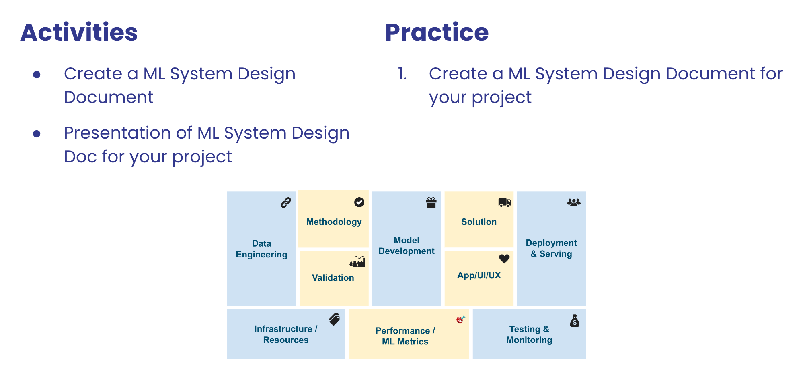
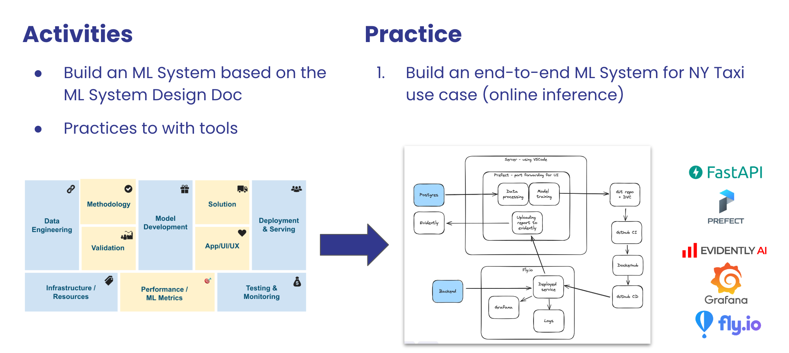
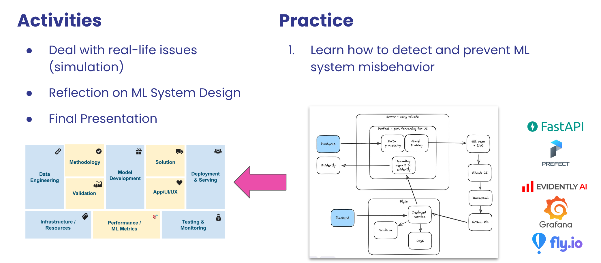

# ML System Design 

## Goals

- Understand the critical role of system design in successful ML projects
- Learn to bridge the gap between business needs and technical solutions
- Develop skills to effectively communicate with stakeholders

## Learning Outcomes

- Differentiate ML System Design from traditional approaches
- Create effective ML design documents
- Set appropriate goals and metrics for ML projects
- Decompose a business request into a set of smaller and better-defined problems

## Outline 

### 1. ML System Design Document

### 2. Implement ML System 

### 3. Reflection on ML System Design

